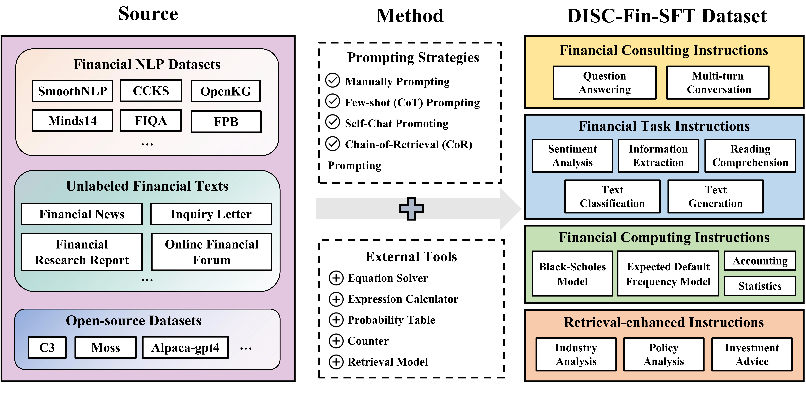
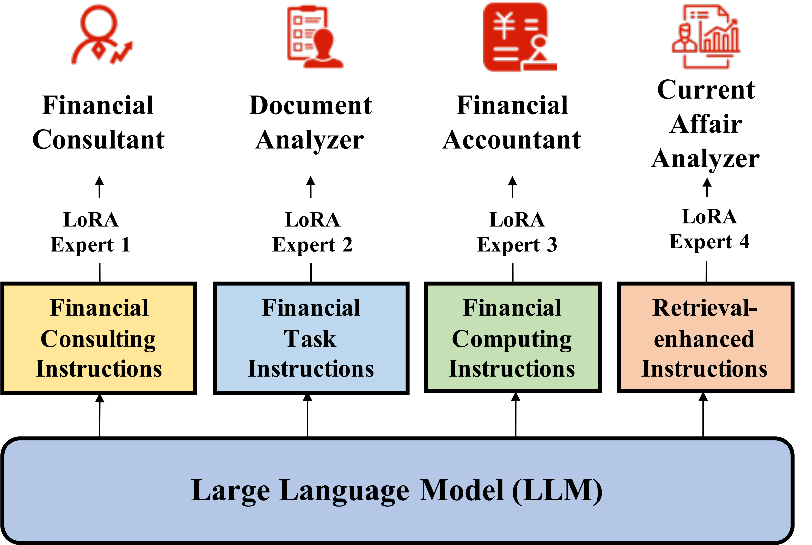

<div align="center">

ZH | [EN](./README-en.md)

<h1>DISC-FinLLM</h1>
  
[](https://huggingface.co/Go4miii/DISC-FinLLM)
[](./LICENSE)

[Demo](https://fin.fudan-disc.com) | [Technical Report](http://arxiv.org/abs/2310.15205)

</div>

DISC-FinLLM is a large model in the financial field specifically designed to provide users with professional, intelligent, and comprehensive **financial consulting services** in financial scenarios. It is developed and open sourced by [Fudan University Data Intelligence and Social Computing Laboratory (Fudan-DISC)](http://fudan-disc.com).

We will open source the following resources in this project:
* [DISC-FinLLM-SFT training data samples](./data)
* [DISC-FinLLM model parameters](https://huggingface.co/Go4miii/DISC-FinLLM)
* [DISC-Fin-Eval Benchmark](./eval)

You can experience our DISC-FinLLM online by visiting this [link](https://fin.fudan-disc.com).


## Table of Contents

- [Overview](#overview)
- [Model Fine-tuning](#model-fine-tuning)
- [Inference and Deployment](#inference-and-deployment)
- [DISC-Fin-Eval Benchmark](#disc-fin-eval-benchmark)
- [Acknowledgements](#acknowledgements)
- [Disclaimer](#disclaimer)
- [Citation](#citation)
- [License](#license)

## Overview


<p></p>

DISC-FinLLM is a large language model in the financial field. It is a multi-expert smart financial system composed of four modules for different financial scenarios: financial consulting, financial text analysis, financial calculation, and financial knowledge retrieval and question answering. These modules showed clear advantages in four evaluations including financial NLP tasks, human test questions, data analysis and current affairs analysis, proving that DISC-FinLLM can provide strong support for a wide range of financial fields. DISC-FinLLM can help in different application scenarios and can be used to implement different functions:

* **Financial Consultation:** This module can start multiple rounds of dialogue with users on financial topics in the Chinese financial context, or explain relevant knowledge of financial majors to users. It is composed of the financial consulting instructions part of the data set.
* **Financial Text Analysis:** This module can help users complete NLP tasks such as information extraction, sentiment analysis, text classification, and text generation on financial texts. It is trained by the financial task instructions in the data set.
* **Financial Calculation:** This module can help users complete tasks related to mathematical calculations. In addition to basic calculations such as interest rates and growth rates, it also supports statistical analysis and includes the Black-Scholes option pricing model and the EDF expected default probability model. Financial model calculations included. This module is partially trained from the financial computing instructions in the data set.
* **Financial Knowledge Retrieval Q&A:** This module can provide users with investment advice, current affairs analysis, and policy interpretation based on financial news, research reports, and related policy documents. It is partially trained from the retrieval-enhanced instructions in the dataset.


### Model effect demonstration

#### Financial Consultation


#### Financial Text Analysis


#### Financial Calculation


#### Financial Knowledge Retrieval Q&A


### DISC-Fin-SFT Dataset
DISC-FinLLM is a large financial model based on the high-quality financial data set DISC-Fin-SFT. We construct and fine-tuned the LoRA instruction on the general-domain Chinese large model Baichuan-13B-Chat. DISC-Fin-SFT contains a total of about 250,000 pieces of data, divided into four sub-data sets, which are financial consulting instructions, financial task instructions, financial computing instructions, and retrieval-enhanced instructions.



| Dataset | Samples | Input Length | Output Length  |
|----------------:|----------------:|------------------------------------------------------------:|-----------------------------------------------------------:|
|    Financial Consulting Instructions |             63k |                                                          26 |                                                        369 |
|    Financial Task Instructions |            110k |                                                         676 |                                                         35 |
|    Financial Computing Instructions |             57k |                                                          73 |                                                        190 |
|    Retrieval-enhanced Instructions |             20k |                                                        1031 |                                                        521 |
|    DISC-Fin-SFT |            246k |                                                         351 |                                                        198 |

#### Financial Consulting Instructions

Financial advisory directive data comes from three parts:
- This is an English financial question and answer dataset where the quality of the answers varies. Therefore, we translate all questions in FiQA into Chinese and used ChatGPT to regenerate the answers to the questions to improve the quality of this data set.
- Explanation of financial terms. We collect more than 200 professional terms in the financial field (such as leveraged buyout) from the Internet, and then use ChatGPT to generate corresponding question and answer pairs for these professional terms to train the model to understand financial terms.
- Public posting on the Economic Management Forum. We use the self-chat prompting method to guide ChatGPT to generate multiple rounds of questions and answers around the post topic.

In the process of guiding ChatGPT to generate data, we ensure that the generated questions and answers are in line with China's national conditions, stance, attitude and language style through carefully designed prompts.

#### Financial Task Instructions
Financial task order data comes from two parts:

- Financial NLP dataset. This part is based on the existing financial NLP data set and adapted from manually written prompts. We collect more than ten open source NLP Chinese data sets, which can be divided into categories such as sentiment analysis, information extraction, text generation, text classification and translation. The distribution of this data set looks like this:


| Dataset            | Major Task Type        | Minor Task Type           | # Samples |
|--------------------|------------------------|---------------------------|-----------:|
| FPB                | Sentiment Analysis     | Sentiment Analysis        |      18690 |
| FIQA-SA            | Sentiment Analysis     | Sentiment Analysis        |          - |
| FNSC               | Sentiment Analysis     | Sentiment Analysis        |          - |
| CCKS-NEC-2022      | Imformation Extraction | Causality Extraction      |       7499 |
| SmoothNLP IEE      | Imformation Extraction | Event Extraction          |       3256 |
| SmoothNLP NHG      | Text Generation        | Text Generation           |       4642 |
| CCKS2022-event     | Text Classification    | Event Type Classification |       3578 |
| Minds14            | Text Classification    | Intent Prediction         |      59143 |
| Financial Report   | Imformation Extraction | Entity Extraction         |      61705 |
| OpenKG             | Imformation Extraction | Entity Extraction         |       7672 |
| OpenKG             | Imformation Extraction | Entity Extraction         |      67921 |
| FDDC2018           | Translation            | Terminology Translation   |        333 |
| Wealth-alpaca-lora | Text Generation     | Keyword Generation        |      41825 |

- Financial unlabeled text dataset. This is a reading comprehension data set of financial texts. We collect a total of 87k articles from Oriental Fortune Network, including financial news and industry research report summaries. Then, based on the paragraphs in these unlabeled texts, we use GPT-3.5 to obtain instruction pairs.

#### Financial Computing Instructions
In financial calculations, four tools, expression calculator, equation solver, normal probability table, and counter, can help models complete most calculation tasks. Each of the four tools has different calling commands, inputs and outputs. For example, the calculator command is **[Calculator(expression)→result]**. In this part, the purpose of building financial calculation instructions is to train the model to call these tools to solve mathematical problems when appropriate. The definitions of the four tools are shown in the table below:
| Tool      | Detail                                   |
|--------------|--------------------------------------------|
| Expression calculator | Input: expression式                 |
|              | Output: result         |
| Equation solver   | Input: equation system                            |
|              | Output: solution                          |
| Counter       | Input: array of samples                   |
|              | Output: sample size                             |
| Probability table       | Input: number                           |
|              | Output: cumulative standard normal distribution function value at this number |

#### Retrieval-enhanced Instructions
The construction of retrieval enhancement instructions is divided into three steps. In the first step, we construct financial analysis questions based on financial texts such as news and research reports. In the second step, we retrieve documents related to the problem in the knowledge base. The reference documents are derived from the financial knowledge base we built, including 18k research reports and 69k financial news. In the third step, we combine the questions and references to generate answers to the questions. In this process, questions and answers are generated by ChatGPT through the Chain-of-Retrieval (CoR) prompting method. In the end, we construct a data set composed of 20k search enhancement instructions. The instructions cover the main forms of analysis in the financial field, including industry analysis, policy analysis, investment advice, company strategic planning, etc.

We show some samples of DISC-FinLLM-SFT training data, you can visit this [link](./data) to download the data set.


## Model Fine-Tuning

### LoRA Fine-Tuning

For different functions in the financial field, we first adopt a multi-expert fine-tuning training strategy. We train each module of the model on a specific sub-dataset so that they do not interfere with each other and complete different tasks independently. To this end, we use Baichuan-13B-Chat as the base model and use the LoRA method to efficiently fine-tune parameters.



Through the four parts of the data set, 4 LoRA expert modules are trained respectively. When deployed, users only need to change the LoRA parameters on the current base to switch functions. This allows users to activate/deactivate different modules of the model based on usage requirements without having to reload the entire model. The four LoRA expert modules are as follows:
- Financial Advisor: This model is used for multi-turn conversations. Because our financial consulting instruction data is very rich, this model can provide high-quality answers in China's financial context, answer professional questions in the financial field for users, and provide high-quality consulting services.
- Document Analyst: This model is mainly used to handle various tasks in the field of financial natural language processing, including but not limited to information extraction, sentiment analysis, etc.
- Financial Accountants: DISC-FinLLM supports four tools, namely expression calculator, equation solver, counter and probability table. These tools support our models to complete most computing tasks in the financial field, such as financial mathematical modeling, statistical analysis, etc. When the model requires the use of a tool, it can generate tool call commands, then interrupt decoding and add the tool call results to the generated text. In this way, DISC-FinLLM can answer computational questions in finance with the help of accurate calculation results provided by the tool.
- Current Affairs Analyst: We introduce the retrieval plug-in in the fourth LoRA training. DISC-FinLLM mainly refers to three types of financial texts: news, reports and policies. When users ask about common financial topics such as current affairs, industry trends, or financial policy, our models can retrieve relevant documents and analyze and provide recommendations like a financial expert.

**You can download our LoRA model weights directly from [Hugging Face](https://huggingface.co/Go4miii/DISC-FinLLM).**

### Full Fine-Tuning

We use Baichuan-13B-Chat as the base model, mix all data, and conduct full fine-tuning tests in the environment of 8 * Nvidia A800 80 GB + deepspeed.

**You can download our fully parametric model weights directly from [Hugging Face](https://huggingface.co/Go4miii/DISC-FinLLM).**


## Inference and Deployment

The current version of DISC-FinLLM is trained based on [Baichuan-13B-Chat](https://github.com/baichuan-inc/Baichuan-13B). We use different data for LoRA training, and use all data for full-parameter training. You can download our model weights directly from [Hugging Face](https://huggingface.co/Go4miii/DISC-FinLLM).


First, you need to install the project's dependent environment.

```
pip install -r requirements.txt
```

### Python

#### Full Parameter Model

```python
import torch
from transformers import AutoModelForCausalLM, AutoTokenizer
from transformers.generation.utils import GenerationConfig
from peft import PeftModel, PeftConfig

model_path = "Go4miii/DISC-FinLLM"
model = AutoModelForCausalLM.from_pretrained(
    model_path, torch_dtype=torch.float16, device_map="auto", trust_remote_code=True
)
model.generation_config = GenerationConfig.from_pretrained(model_path)
tokenizer = AutoTokenizer.from_pretrained(
    model_path, use_fast=False, trust_remote_code=True,
)

messages = [
    {"role": "user", "content": "请解释一下什么是银行不良资产？"},
]
response = model.chat(tokenizer, messages)
print(response)
```
#### LoRA Model

```python
import torch
from transformers import AutoModelForCausalLM, AutoTokenizer
from transformers.generation.utils import GenerationConfig
from peft import PeftModel, PeftConfig

model_path = "baichuan-inc/Baichuan-13B-Chat"
model = AutoModelForCausalLM.from_pretrained(
    model_path, torch_dtype=torch.float16, device_map="auto", trust_remote_code=True
)
model.generation_config = GenerationConfig.from_pretrained(model_path)
tokenizer = AutoTokenizer.from_pretrained(
    model_path, use_fast=False, trust_remote_code=True,
)
model = PeftModel.from_pretrained(model, lora_path)

messages = [
    {"role": "user", "content": "请解释一下什么是银行不良资产？"},
]
response = model.chat(tokenizer, messages)
print(response)
```


### Command Line Tool

```
python cli_demo.py
```

### Web Demo

Based on streamlit, the following command will start a web server. The console will output an address, which can be visited by entering in the browser:

```
streamlit run web_demo.py --server.port 8888
```


In addition, the current version of DISC-FinLLM uses Baichuan-13B as the base. You can refer to the introduction of [Baichuan-13B](https://github.com/baichuan-inc/Baichuan-13B) to perform int8 or int4 Quantitative inference deployment and CPU deployment.

## DISC-Fin-Eval-Benchmark

We establish a comprehensive evaluation framework - DISC-Fin-Eval Benchmark, to rigorously evaluate our models from all angles. The assessment framework consists of four different components, namely: financial NLP tasks, human tests, data analysis and current affairs analysis. This evaluation framework comprehensively demonstrates the capabilities of our model and the validity of our training data. You can use our DISC-Fin-Eval-Benchmark by clicking this [link](./eval).

### Evaluation System

#### Financial NLP Tasks Evaluation
We use FinCUGE to evaluate a benchmark model's ability to handle financial NLP tasks. This evaluation contains a total of eight tasks, including sentiment analysis, relationship extraction, text summarization, text classification, event extraction and other tasks. We transform this data set into a few-shot form through prompt templates, and use commonly used accuracy, F1 and Rouge indicators to evaluate the performance of the model to measure the model's ability to understand text and generate relevant answers in the financial field. The evaluation results (%) are as follows:
|  Model   ↓  Eval On →  | FinFE (Accuracy) | FinQA (F1) | FinCQA (F1) | FinNA (ROUGE) | FinRE (F1) | FinESE (F1) | Avg |
|:-----------------:|:----------------:|:----------:|:-----------:|:-------------:|:----------:|:-----------:|:------:|
| Baichuan-13B-Chat |       64.8       |    38.1    |     33.6    |      31.0     |     9.1    |     18.6    |  31.0  |
|            (LoRA) |       69.3       |    42.4    |     42.0    |      30.9     |    10.1    |     45.3    |  40.0  |
|           ChatGLM |       56.7       |    31.8    |     35.1    |      32.5     |    13.0    |     48.7    |  36.3  |
|            (LoRA) |       60.7       |    41.4    |     36.4    |      34.7     |    10.7    |     46.2    |  38.4  |
|          ChatGLM2 |       61.3       |    28.8    |     35.9    |      28.9     |    11.7    |     42.1    |  34.8  |
|            (LoRA) |       65.3       |    37.6    |     36.4    |      33.4     |    11.8    |     39.5    |  37.3  |

**You can view the specific content of our [Financial NLP Tasks Evaluation](https://github.com/FudanDISC/DISC-FinLLM/tree/main/eval/evaluator) here.**

#### Human Tests Evaluation
We evaluate the model's ability to answer financial questions generated by real people using the FIN-Eval benchmark, which covers high-quality multiple-choice questions in finance, economy, accounting, certificate. We use accuracy as an indicator to measure the performance of the model. The evaluation results (%) are as follows:
| Model                     | Finance | Economy | Accounting | Certificate | Avg |
|--------------------------|-----:|-----:|-----:|-----:|-------:|
| GPT-4                    | 71.0 | 74.5 | 59.3 | 70.4 |   68.6 |
| ChatGPT                  | 59.3 | 61.6 | 45.2 | 55.1 |   55.0 |
| Baichuan-13B-Base        | 52.6 | 50.2 | 43.4 | 53.5 |   50.1 |
| Baichuan-13B-Chat        | 51.6 | 51.1 | 41.7 | 52.8 |   49.4 |
| ChatGLM2-6B              | 46.5 | 46.4 | 44.5 | 51.5 |   47.4 |
| InternLM-7B              | 49.0 | 49.2 | 40.5 | 49.4 |   47.1 |
| InternLM-Chat-7B         | 48.4 | 49.1 | 40.8 | 49.5 |   47.0 |
| LLaMA-2-Chat-70B         | 47.1 | 46.7 | 41.5 | 45.7 |   45.2 |
| FinGPT-v3-6B             | 50.5 | 42.5 | 50.8 | 52.1 |   49.6 |
| DISC-FinLLM （Consulting） | 54.4 | 45.4 | 52.8 | 51.8 |   51.6 |
| DISC-FinLLM （Task） | 57.4 | 48.8 | 49.5 | 49.7 |   51.5 |
| DISC-FinLLM （Retrieval） | 56.1 | 44.0 | 49.5 | 50.6 |   50.6 |
| DISC-FinLLM （Computing） | 54.8 | 50.2 | 46.9 | 50.6 |   50.9 |
| DISC-FinLLM （full）   | 53.8 | 47.9 | 42.0 | 49.1 |   48.7 |


#### Financial Computing Evaluation
We manually construct a data set consisting of 100 financial calculation questions to evaluate the model's ability in calculation tasks. These assessment questions are adapted from the material analysis and calculation questions in the China Administrative Vocational Aptitude Test, including calculating year-on-year growth rates and output value ratios. We evaluate the performance of the model based on the accuracy of the calculation formulas and calculation results given by the model. The evaluation results are as follows:
|                          | Formula | Formula & Result |
|--------------------------|:--------:|:--------------:|
| GPT-3.5-turbo            |   0.28   |      0.26      |
| Baichuan-13B-Chat        |   0.20   |      0.12      |
| DISC-FinLLM （Computing） |   0.35   |      0.35      |


#### Data Analysis Evaluation
This evaluation is based on the GPT-3.5 model. We build a dataset of financial questions that require the model to use the latest information to get accurate answers. We then manually search in search engines such as Google to collect multiple reference passages relevant to each question. This data set is designed to evaluate the relevance and accuracy of the information retrieved by the model when answering financial questions. We use four indicators to evaluate the performance of the model, namely accuracy, usefulness, linguistic quality and reflectiveness. The evaluation results are as follows:
|                          | accuracy | usefulness | linguistic quality  | reflectiveness |
|--------------------------|:------:|:------:|:--------:|:------:|
| Baichuan-13B-Chat         |  4.08  |  4.15  |   4.21   |  3.88  |
| DISC-FinLLM（Retrieval） |  4.13  |  4.29  |   4.33   |  3.95  |

**You can view our [Data Analysis Evaluation](https://github.com/FudanDISC/DISC-FinLLM/tree/main/eval/computing_eval.json), [Current Affairs Analysis Evaluation](https://github.com/FudanDISC/DISC-FinLLM/tree/main/eval/retriever_eval.json) data set.**


## Acknowledgements

This project is built upon the following open-source projects, and we would like to express our sincere gratitude to the respective projects and developers:

- [**Baichuan-13B**](https://github.com/baichuan-inc/Baichuan-13B)
- [**Langchain-Chatchat**](https://github.com/chatchat-space/Langchain-Chatchat)
- [**LLaMA Efficient Tuning**](https://github.com/hiyouga/LLaMA-Efficient-Tuning)
- [**FireFly**](https://github.com/yangjianxin1/Firefly)
- [**FinEval**](https://github.com/SUFE-AIFLM-Lab/FinEval)

We also extend our gratitide to other contributors who have provided valuable assistance to this project, though not explicitly listed due to the limited space.


## Disclaimer

DISC-FinLLM has problems and shortcomings that cannot be overcome by current large language models. Although it can provide services in the financial field on many tasks and scenarios, the model should be used for user reference only and cannot replace professional financial analysts and financial experts, we hope that users of DISC-FinLLM will be able to critically evaluate the model. We are not responsible for any problems, risks or adverse consequences arising from the use of DISC-FinLLM.

## Citation

Update coming soon.

<!-- If our project has been helpful for your research and work, please kindly cite our work as follows:

```
@misc{yue2023disclawllm,
    title={DISC-LawLLM: Fine-tuning Large Language Models for Intelligent Legal Services}, 
    author={Shengbin Yue and Wei Chen and Siyuan Wang and Bingxuan Li and Chenchen Shen and Shujun Liu and Yuxuan Zhou and Yao Xiao and Song Yun and Xuanjing Huang and Zhongyu Wei},
    year={2023},
    eprint={2309.11325},
    archivePrefix={arXiv},
    primaryClass={cs.CL}
}
``` -->

## License

DISC-FinLLM is available under the Apache License. See the [LICENSE](./LICENSE) file for more information.


